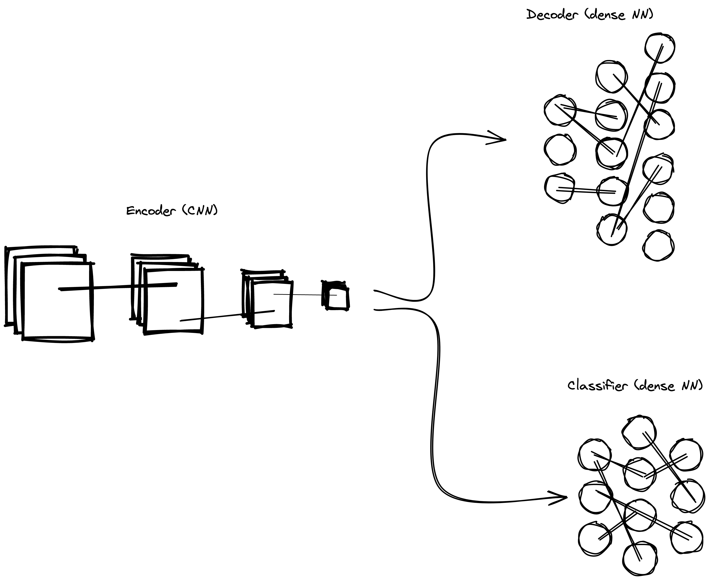

# Convolutional Autoencoder

Implementation of a convolutional autoencoder in Julia using Flux.

All of the interesting info can be found in the [Jupyter Notebook](autoencoder.ipynb). In summary, a model learns how to represent a whole image of a digit in just two numbers (which is a 99.21% compression rate).
